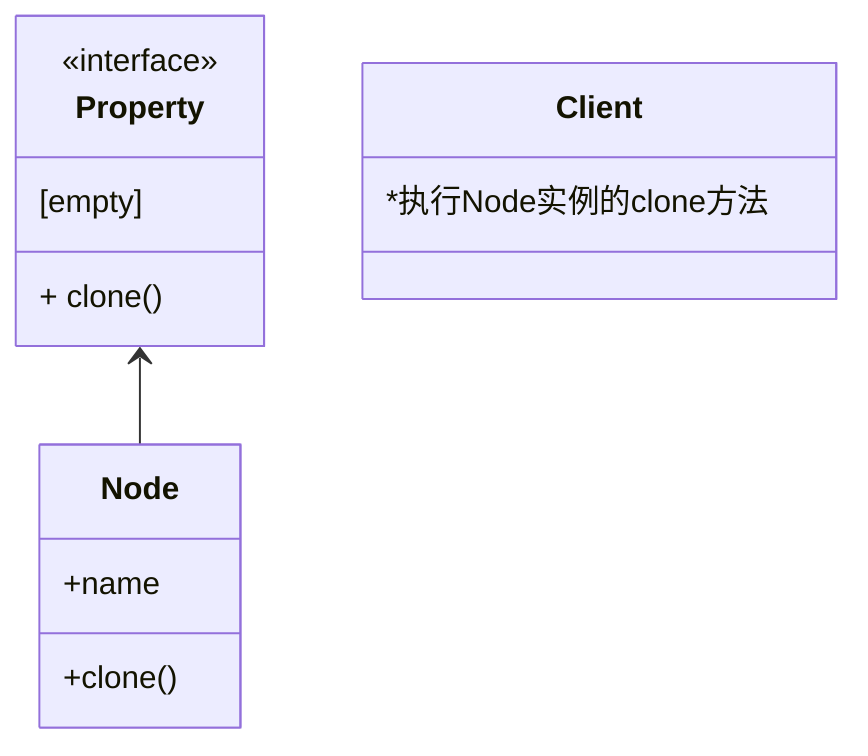

# 设计模式

软件工程中，一个明确的需求确定后，需要从自顶向下的逐步拆解。

将功能分层，分层拆解成模块，模块拆解成对象，对象抽象成类（结构），小的对象可以组合成为功能强大的对象。

对象与对象之间需要建立合适的通讯，进行数据传递。

而是设计模式正式为了解决这三个问题

- 怎么创建基础对象
- 怎么将基础对象组合成一个功能强大的对象
- 怎么建立对象之间的通信关系

---

- 对接口编程而不是对实现编程。
- 优先使用对象组合而不是继承。

## 设计原则

- 开闭原则，对扩展开放，对修改关闭
- 合成复用原则
- 最少知道原则，一个实体尽可能少的可其他实体互动，模块独立
- 接口隔离原则，降低耦合度，“客户端不应该依赖他不需要的接口”，最小依赖原则
- 依赖倒置原则，“针对接口编程，不针对实现编程”，让抽象稳定。面向对象的开发很好的解决了这个问题，一般情况下抽象的变化概率很小，让用户程序依赖于抽象，实现的细节也依赖于抽象。即使实现细节不断变动，只要抽象不变，客户程序就不需要变化。这大大降低了客户程序与实现细节的耦合度。

接口和抽象

## 创建型（5）

- 工厂模式
- 抽象工程模式
- 建造者模式
- 单例模式
- 原型模式

### 工厂模式（\*）

#### 核心描述

不知道具体类型的情况下，创建一批具有相似共性的对象。

- 用户
- 工厂
- 产品线（多条）

vue-router 中 History 系列对象就是工厂模式创建出来的。

（用户需求）对于 vue 开发者而言，需要使用 vue-router，业务代码中常用的方法如下

- push
- pop
- replace
- go
- route（获取路由属性信息）
- beforeRouteLeave（离开钩子）
- ......

vue-router 生成过程

```typescript
// main.js
function createRouter() {
  return new VueRouter({
    mode: "hash",
    routers: [],
  });
}
```

```typescript
class VueRouter {
  constructor(options) {
    let mode = options.mode || "hash";

    switch (mode) {
      case "history":
        this.history = new HTML5History(this, options.base);
        break;
      case "hash":
        this.history = new HashHistory(this, options.base, this.fallback);
        break;
      case "abstract":
        this.history = new AbstractHistory(this, options.base);
        break;
      default:
        if (process.env.NODE_ENV !== "production") {
          assert(false, `invalid mode: ${mode}`);
        }
    }
  }
}
```

```typescript
interface BaseHistory {
  go(n: numbr): void;
  push(location: Location, cb: Function): viod;
  pop(): viod;
  replace(): viod;
}
```

定义一个基类 base，

其他三种 History 类继承 base [HTML5History, HashHistory, AbstractHistory]

实例化 Vue-Router 的时候，根据 mode 选择创建不同的 History 类

而对于业务开发者而言，都是使用的标准化的方法

其他思考：

1. 在业务流程稳定的场合，History 进行优化升级拓展的时候，只需要实现 BaseHistory 接口，然后切换 mode，就是完美切换
   - 遵循开闭原则：业务代码闭合，VueRouter 开放
2. 前端的菜单-内容结构，（考虑使用工厂模式）
   - 菜单区域的选中或者切换，产生新的参数
   - 内容区是否多个地方依赖这个参数来进行不同的行为判断
3. 同一条件多处使用 switch，if 判断处理的地方，值得考用重新定义接口采用工厂模式来重构
4. 实操的关键
   - 满足工厂模式能解决的问题
   - 找准 switch 点
   - 定义内容区的关键动作的接口
5. switch 中如果是多条件呢？type， option

自动发现为例

1. 菜单选择资源类型，switch 点【v4 子网，v6 子网，设备，未管理】
2. 内容区接口
   - 获取列表
   - columns
   - 导出

```typescript
interface DiscoveryContent {
  getDataList(): void;
  columns: array;
  handleExport(): viod;
}
```

可能会增加一些冗余，但是会让各自的内部更加清晰。

不过

如果 columns 中要增加一个字段，可能就得改 4 份儿

如果 handleExport 中有一个增加的额外调用，也是调用 4 分

抽象的接口中的内容变化，则工作量剧增

什么场景下适合使用工厂设计模式？

什么场景下不适合使用工厂设计模式？

### 抽象工厂模式

#### 核心描述

### 建造者模式

#### 核心描述

分步骤创建复杂的对象

### 单例模式（\*）

#### 核心描述

创建出唯一的对象，避免对象重复创建

```typescript
class Singleton {
  constructor() {
    this.instance = null;
  }
  static getInstance() {
    if (!this.instance) {
      this.instance = new Singleton();
    }
    return this.instance;
  }
}
```

```typescript
function clientCode() {
  const s1 = Singleton.getInstance();
  const s2 = Singleton.getInstance();

  console.log(s1 === s2); // true
}
```

**本质是使用一个变量保存实例**

#### 应用场景

- vue loading 封装成全局 api
- vue2.x 的插件安装器，Vue-use
  - 多次调用 Vue.use 方法也只会创建一个实例来保存 vue 插件资源

```typescript
// Vue 源码
export function initUse(Vue: GlobalAPI) {
  Vue.use = function (plugin: Function | Object) {
    const installedPlugins =
      this._installedPlugins || (this._installedPlugins = []);
    if (installedPlugins.indexOf(plugin) > -1) {
      return this;
    }

    // additional parameters
    const args = toArray(arguments, 1);
    args.unshift(this);
    if (typeof plugin.install === "function") {
      plugin.install.apply(plugin, args);
    } else if (typeof plugin === "function") {
      plugin.apply(null, args);
    }
    installedPlugins.push(plugin);
    return this;
  };
}
```

```js
import { Spin } from "xxx";

const Loading = function (Vue, options) {
  let loadingEl = null;
  Vue.prototype.$loading = function () {
    if (!loadingEl) {
      loadingEl = Spin;
    }

    loadingEl.open();

    setTimeout(() => {
      loadingEl.close();
    }, 2000);
  };
};

const LogingPlugin = {};

LogingPlugin.install = Loading;

export default LogingPlugin;
```

### 原型模式

#### 核心描述

用实例来创建对象，通常面向对象的语言创建对象是通过先创建类，然后再 new 实例化对象。

而原型模式是通过实现 clone 接口，让对象实例调用自身 clone 创建对象

- 深拷贝
- 浅拷贝
- 纯数据

```typescript
interface Property {
  clone(): object;
}
```



#### 组成部分

- 抽象原型类，定义 clone 方法
- 具体原型类，实现 clone 方法
- 访问者，调用 clone 方法

#### 实现思路

#### 场景案例

目前前端体系中很少使用类的方式来单出创建可克隆对象，通常使用深拷贝或者浅拷贝处理

## 结构型(7)

- 适配器模式
- 桥接模式
- 组合模式
- 装饰者模式
- 外观模式
- 享元模式
- 代理模式

### 适配器模式

- Target（目标）
- Adaptee（被适配对象）
- Adapter（适配器）

适配器是继承目标实现的

适配器构造时，传入被适配对象实例作为参数

适配器实现目标的方法

可以像调用目标那样的调用适配器（达到使用方式一致的效果）

> 适配器接收一个对象，转换成另一个对象可识别的接口和格式

可以是接口的一致，也可以是数据的一致

#### 应用场景

通常再做多种资源整合的时候就很容易使用到适配器模式

后端来自于多个服务方，进行整合时

```typescript
interface Response {
  code: number;
  data: object;
  message: string;
}
```

```typescript
// 服务端A
interface ResponseA {
  code: number;
  data: object;
  err: string;
}
```

```typescript
interface ResponseB {
  code: number;
  data: object;
  msg: string;
}
```

处理方法

```typescript
class ResponseAdapter implements Response {
  constructor(res) {
    this.code = res.code;
    this.data = res.data;
    this.message = res.err || res.msg;
  }
}
```

```typescript
const ra = ResponseA();
const rb = ResponseB();

const rsa = new ResponseAdapter(ra);
const rsb = new ResponseAdapter(rb);
```

另一个例子，媒体播放器，我们常见的媒体有，mp3，mp4，png；

```typescript
interface MediaPlayer {
  play(): void;
}
```

```typescript
interface AdvancedMediaPlayer {
  playMp3(): void;
  playMp4(): void;
}
```

```typescript
class Mp3Player {
  playMp3() {}
}

class Mp4Player {
  playMp4() {}
}
```

```typescript
class MediaAdapter implements MediaPlayer {
  play(type, file) {
    if (type === "mp3") {
      const mp3 = new Mp3Player();
      return mp3.playMp3(file);
    }
    if (type === "mp4") {
      const mp4 = new Mp4Player();
      return mp4.playMp4(file);
    }
  }
}
```

```typescript
class AudioPlayer implements MediaPlayer {
  play(type, file) {
    if (["mp3", "mp4"].include(type)) {
      const media = new MediaAdapter(type, file);
      return media.play(type, file);
    }
    if (type === "png") {
      return "png已内置";
    }

    return "不支持的格式";
  }
}
```

### 装饰者模式

#### 核心描述

- 原对象
- wrapper 对象
- wrapper 对象
- ...

美军七层穿衣法则，吸汗扩散，保温透气，保暖透气，防风耐磨，防水。 不穿也没关系，或者随机任取几件也能通过拉链、绳子和魔术贴有效组合。

原对象和装饰者对象都遵循同一个接口，可以无限装饰，对原有对象的功能增强或者约束。

进一步理解，这属于锦上添花的场景，不会因为缺少装饰，而导致接口不可运转。

原来的对象依然可以单独使用。装饰器也可以用于其他对象。

js 动态去拓展一个对象的属性，客户端使用新属性，不一定属于装饰者模式。

对于面向对象语言而言，创建实例的途径是通过 new 实例化类。不能直接操作实例化的对象。

#### 组成部分

- 抽象类
- 具体基础类
- 装饰类
- 具体装饰器

#### 常见的场景

- react hoc（高阶组件），可以渲染出更丰富的内容，对 render 增强

```react
// 基础XInput组件
import {Component} from "react"
export default class XInput extends Component {
    constructor(props){
        super(props)
    }

    render () {
        return <div class="xInput"><input /></div>
    }

}
```

```react
// 装饰器
function withTips (component, message) {
    return <div>
    		<component />
        	<div>{message}</div>
    	</div>
}
```

```javascript
//
withTips(XInput, "hello");
```

这个案例增加 render 方法。但对于讲述装饰者模式而言不够明显。

原组件本身具备的东西如渲染函数，组件特性并没改变。

- 游戏属性加成

```typescript
interface Hero {
  attack(): viod;
}
```

```typescript
class Galen implements Hero {
  constructor() {
    this.power = 150; // 力量
    this.speed = 0.65; // 移动速度
    this.range = 120; // 射程
  }
  attack(target) {
    const { power, speed, range } = this;
    // 进行攻击...
  }
}
```

```typescript
class Power10Equip implements Hero {
  constructor(hero) {
    this.hero = hero;
    this.power = 10;
  }
  attack(target) {
    const power = this.power + this.hero.power;
    // 进行攻击...
    this.hero.attack();
  }
}
```

```typescript
class Power20Equip implements Hero {
  constructor(hero) {
    this.hero = hero;
    this.power = 20;
  }
  attack(target) {
    const power = this.power + this.hero.power;
    // 进行攻击...
  }
}
```

```typescript
function attackClient(hero, target) {
  hero.attack(target);
}
```

```typescript
const galen = new Galen();
const galen1 = new Power10Equip(galen);
const galen2 = new Power20Equip(galen1);
// ....

attackClient(galen2, galen);
```

深度思考：

- 任务队列，插件，是否属于装饰者模式？
- 用继承也能实现类似效果，但是这明显不属于父子继承关系
- 装饰者专注于需要装饰的接口本身
- 装饰者会增加原对象功能，而不会改变原对象

### 桥接模式

楼下瑞幸卖咖啡

```typescript
interface Coffee {
  create(): void 0
}
```

我点了一个大杯

```typescript
class BigCupCoffee implements Coffee {
  constructor() {
    this.size = "big";
  }
  create() {}
}
```

默认是热咖啡，但是我选择少量加一点冰

```typescript
class LessIceBigCupCoffee extends BigCupCoffee {
  constructor(prop) {
    super(prop);
    this.ice = "less";
  }
  create() {}
}
```

好像也没什么问题。

然后来了大量其他顾客订单

- 中杯热咖啡
- 大杯多冰咖啡
- 小杯去冰咖啡
  ...

```typescript
class MiddleCupCoffee implements Coffee {}

class hotMiddleCupCoffee extends MiddleCupCoffee {}

class NoIceBigCupCoffee extends BigCupCoffee {}

class SmallCupCoffee implements Coffee {}

class NoIceSmallCupCoffee extends SmallCupCoffee {}
```

忙活很久，终于搞定了，但是新品研发出来了。可以加糖，半塘，无糖，微糖。加奶，不加奶

简单梳理

|      | 种类数量 | 枚举             |     |
| ---- | -------- | ---------------- | --- |
| 杯子 | 3        | 大，中，小       |     |
| 加冰 | 3        | 去冰，少冰，加冰 |     |
| 加糖 | 3        | 无糖，微糖，半糖 |     |
| 加奶 | 2        | 加奶，不加奶     |     |

如果按照之前的方式来实现每一个不同类型的类，

$$
S =  3 * 3 * 3 * 2 + 3 + 3 + 3 + 2

S = 65
$$

会创建 65 个类。

重新分析这个场景的问题。瑞幸生产咖啡，生产咖啡的基本点恒定

```typescript
interface Coffee {
  create(): viod;
}
```

算上新品，可以将咖啡抽象出，杯子大小，加冰，加糖，加奶四个维度

```typescript
abstract class LuckinCoffee implements Coffee {
  chooseCup(): viod;
  addIce(): viod;
  addSugar(): viod;
  addMilk(): viod;
  create(): viod;
}
```

桥接模式是将抽象部分与它的实现部分分离，使它们都可以独立地变化

将一个大的对象经行分层设计

- 抽象层    Abstraction    =>  包含一个对实现化对象的引用
- 拓展抽象  RefinedAbstraction
- 实现层    Implementor
- 具体实现  Concrete Implementor
- 客户端


#### 实例场景

两个或者多个维度的变化。假设一个对象有 3 个关键属性，颜色，大小，材质。而颜色有 5 种，大小有 3 种，材质 2 种。这种条件下可以创造出来的对象就有

```
S = 5 * 3  *  2
```

显然维护这么多对象是比较代价沉重的。


二次封装第三方库的时候。


### 组合模式

个体和整体组合成树状结构，能像使用独立对象的一样使用它们。

是一种层级结构

消息传递？便于消息传递；逐级下发

### 外观模式

### 享元模式

有限的数据载体下承载尽可能多的数据。

不同对象之间如果有相同数据，则不会为每一个对象都单独一份儿数据

虚列表其实也是一种享元模式的设计思路

### 代理模式

#### 核心描述

- 一个服务
- 一个 proxy
  - 可以进行校验，日志
- 客户端

提供一个代理占位符，代理可以访问原对象，允许请求原对象前后增加其他操作。

原来要干的事，一成不变，代理层可以增加一些独有动作。缓存，限制，保护

```typescript
interface ServiceInterface {
  request(): void;
}
```

```typescript
class Service implements ServiceInterface {
  request() {
    console.log("真实请求");
  }
}

class ProxyService implements ServiceInterface {
  constructor(service: Service) {
    this.service = service;
  }
  request() {
    if (this.check()) {
      this.service.request();
      this.log();
    }
  }
  check() {
    console.log("检测");
    return true;
  }
  log() {
    // 输出日志，写入日志
  }
}
```

```typescript
function clientCode(service: ServiceInterface) {
  service.request();
}
```

```typescript
const service = new Service();
const proxy = new ProxyService(service);

clientCode(proxy);
```

#### 场景案例

- 权限控制场景，解决安全性问题
- 缓存控制
-

代理模式和装饰者模式和适配器模式和中介者模式 之间的区别？

#### 思考总结

- 代理模式不改变原有对象接口的行为效果，不会增强也不会减弱 （装饰者模式会增强）
- 代理模式可以增加额外与原对象无关的动作。用于控制和横向拓展
- 代理模式可以保护原对象。
- 代理模式不会改变原对象的解构 （适配器模式会改变解构）
-

## 行为型（11）

- 责任链模式
- 命令模式
- 解释器模式
- 迭代器模式
- 中介者模式
- 备忘录模式
- 观察者模式
- 状态模式
- 空对象模式
- 策略模式
- 模板模式
- 访问者模式

### 责任链模式

#### 核心描述

行为型主要关注对象之间的通信

### 命令模式

### 解释器模式

定义文法+解释器 模式

### 迭代器模式

### 中介者模式

### 备忘录模式

### 观察者模式

### 状态模式

### 策略模式

### 模板模式

### 访问者模式

